> # Task Master

> > ## Homepage

* Homepage with RecyclerView:

  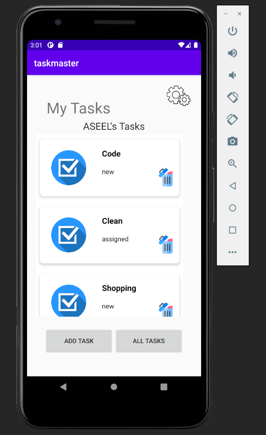

* Homepage Before Set username:

  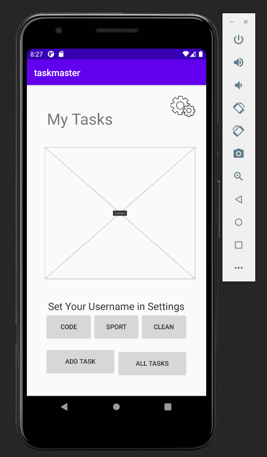

* Homepage After Set username:

  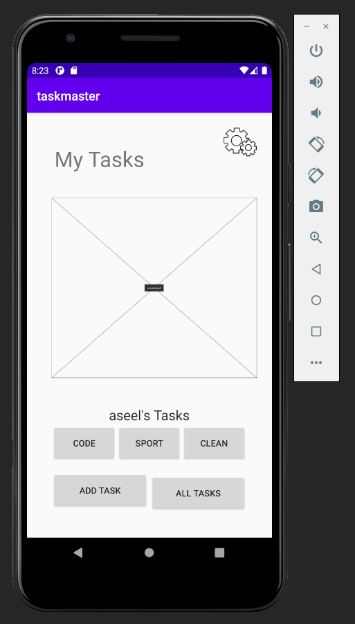

> > ## Setting page

* Settings Before Set username:

  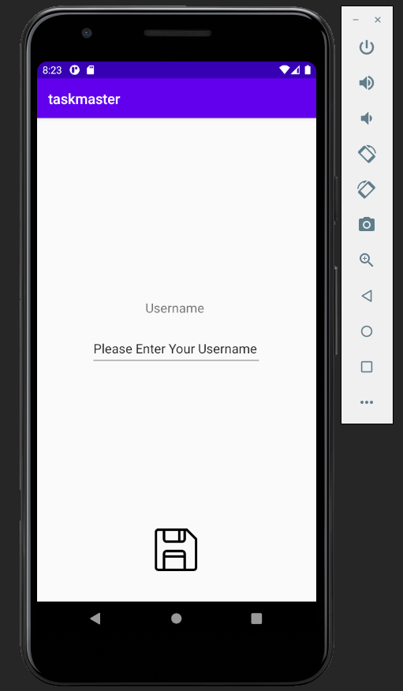

* Settings After Set username:

  

> > ## Add a Task page

  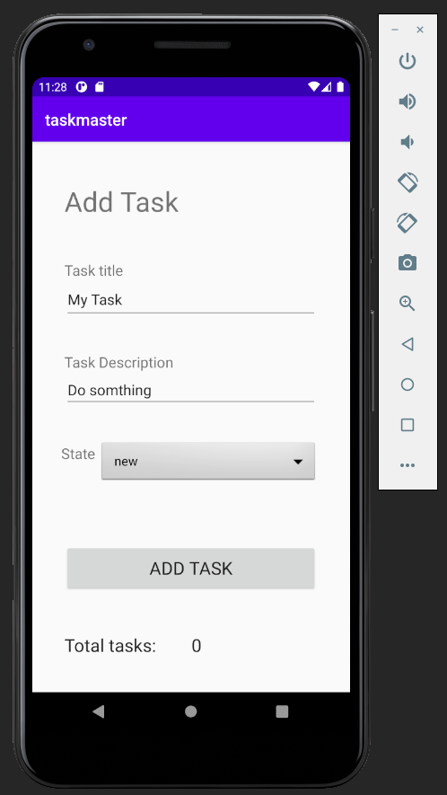

  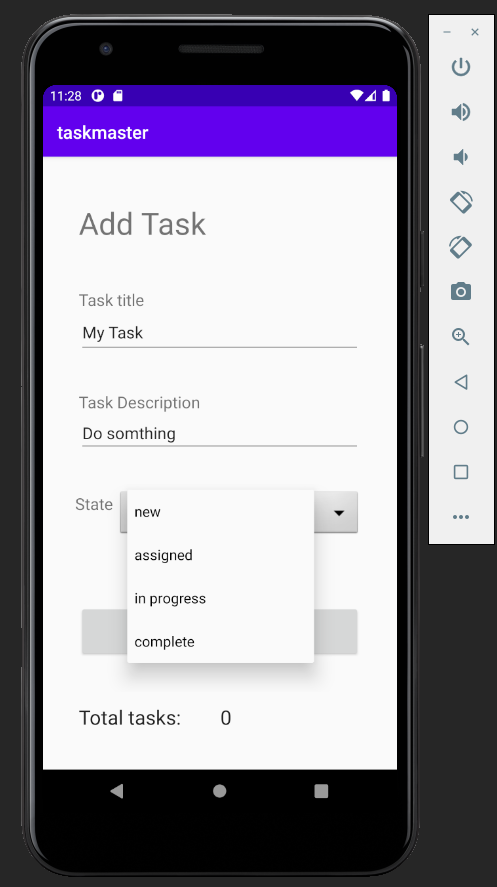

  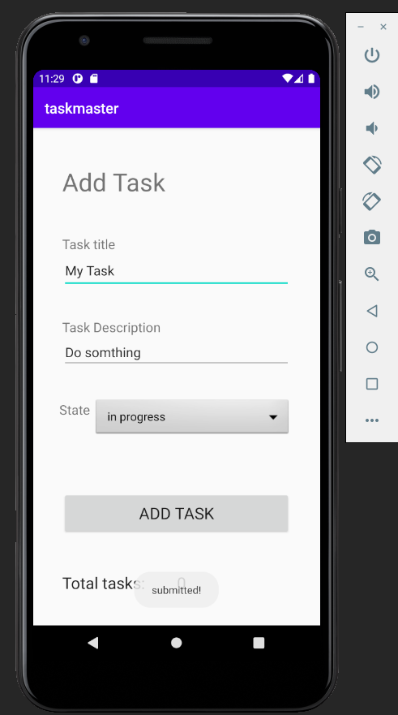

> > ## All tasks page

  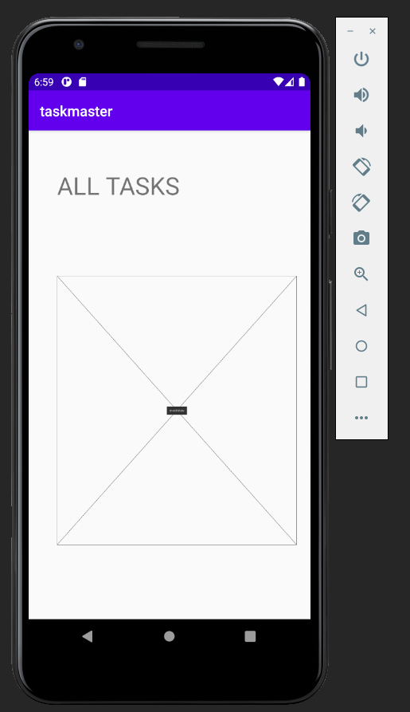

> > ## Details page

  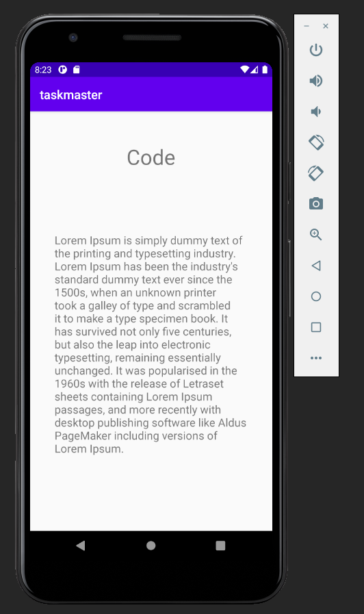

  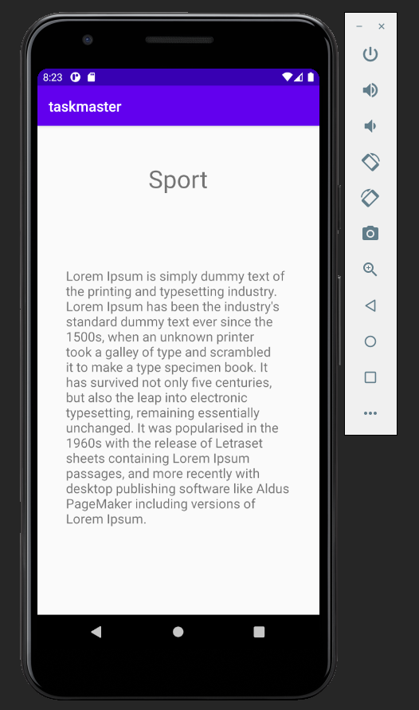

  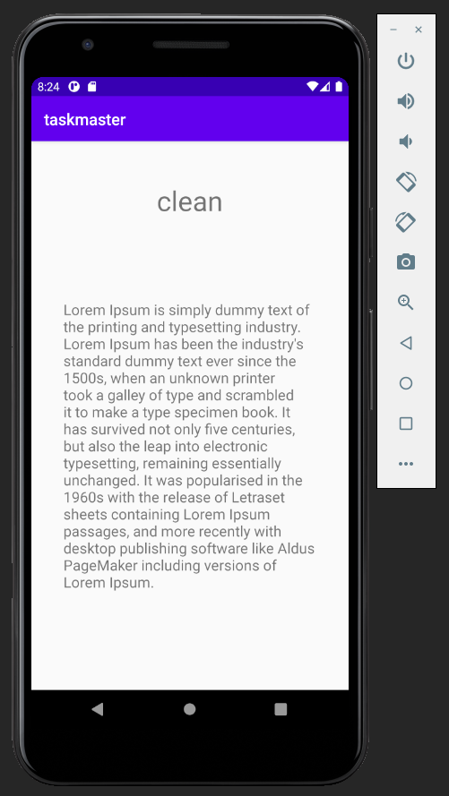

