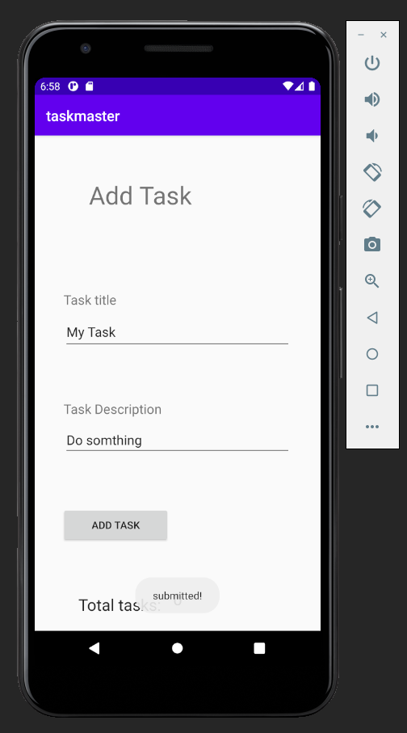

# Task Master

> ## Homepage

* Homepage Before Set username:

* Homepage After Set username:

> ## Setting page

* Settings Before Set username:

* Settings After Set username:
  

> ## Add a Task page

> ## All tasks page

> ## Details page

